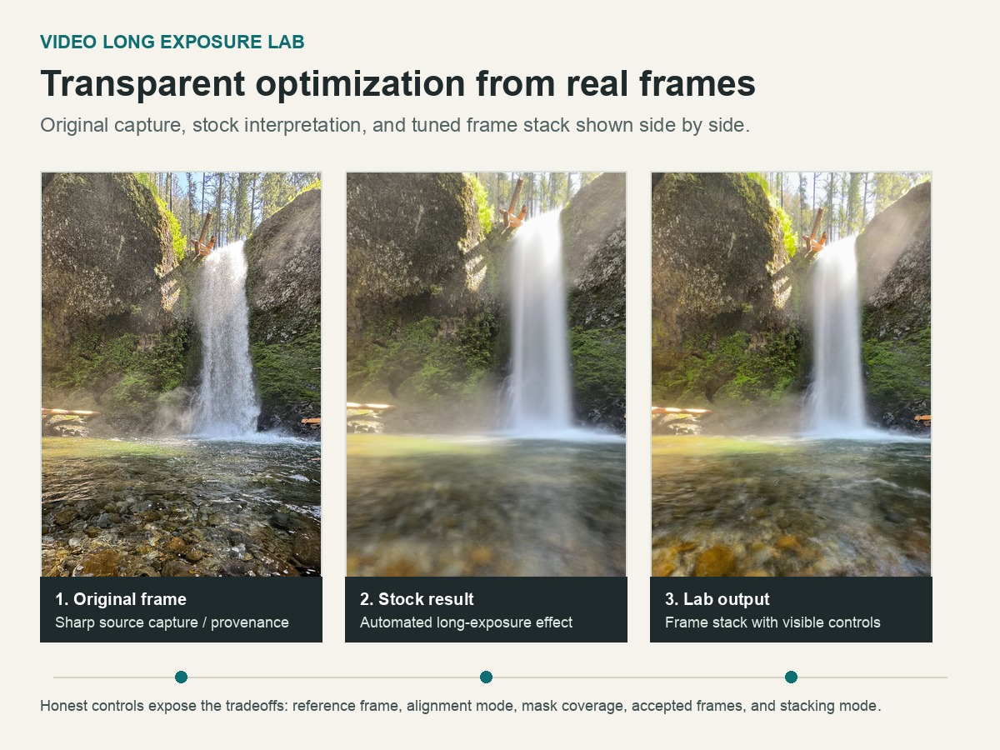
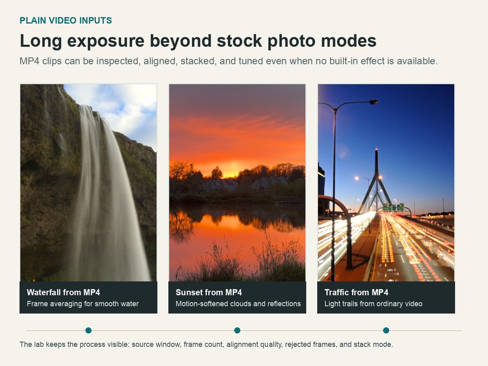

# Video Long Exposure Lab

A Streamlit app that converts short video clips into long-exposure
still images using transparent frame alignment and photographic averaging.

Try the hosted demo:
[video-long-exposure-lab.streamlit.app](https://video-long-exposure-lab.streamlit.app)

## Gallery



The app is designed to make the optimization process visible: users can compare
the source frame, the available stock output when one exists, and the result from
an explicit frame-stacking workflow.



Because the pipeline starts from video files, it also works with ordinary
`.mp4`, `.mov`, and `.m4v` clips where stock photo long-exposure effects are not
available.

## Motivation

iOS Photos can turn Live Photos into a long-exposure image, but the automatic
process is a black box and may not yield the best results; there is also no
stock processing option for stored videos.

Dedicated long-exposure apps usually require deciding at capture time, while
traditional daytime long-exposure photography asks for a tripod and neutral
density filters.

Video Long Exposure Lab explores a reproducible alternative: take an ordinary
short video, make the alignment/rejection decisions visible, and produce an
honest still image from the frames that actually align.

## What It Does

The app runs a full local computer-vision pipeline:

1. Upload a `.mov`, `.mp4`, or `.m4v`, or choose a hosted demo clip.
2. Extract frames from a selected time window.
3. Score frame sharpness and select a reference frame.
4. Optionally paint an alignment exclusion mask.
5. Align frames with ORB feature matching and a RANSAC affine transform.
6. Reject poorly aligned frames by match count and inlier ratio.
7. Stack accepted frames.
8. Crop unstable borders.
9. Export PNG or JPEG output.
10. Show diagnostics for sharpness, acceptance, inlier ratio, and warnings.

The workflow is intentionally inspectable. It shows which frames were accepted,
why others were rejected, which reference frame was selected, and how alignment
settings changed the final image.

## Honest Photographic Mode

The default output is a full-frame aligned average. The app does not replace only
the water, sky, or traffic region with a synthetic blur. Every accepted frame
contributes to the full image after alignment.

That constraint is intentional. It keeps the result tied to the source video and
makes artifacts easier to reason about. If the source clip is soft, compressed,
or badly aligned, the app explains that instead of hiding the tradeoff.

## Optional Computational Modes

The default mode is mean photographic averaging, but the app also exposes a few
controlled alternatives:

- `Sigma-clipped mean`: reduces outlier frames or noisy pixel values.
- `Median`: suppresses transient motion and can be useful for cleanup.
- `Lighten / star trails`: keeps the brightest pixel/channel values for night
  photography, light trails, fireworks, and star trails.
- `Additive / sum`: sums frames with gain control, useful experimentally but
  easy to saturate.
- `Alignment exclusion mask`: lets the user paint moving regions, such as
  water, that should not be used to estimate camera motion.

For tripod star trails, alignment can be disabled so the stars move naturally
through the stack. If alignment is used for night scenes, it should be guided by
static foreground rather than stars.

## Alignment Modes

The app supports three alignment modes:

- `Auto alignment`: aligns using the whole frame and is the safest hosted-demo
  default.
- `No alignment`: stacks frames directly, useful for tripod shots, star trails,
  or clips where camera motion is not a problem.
- `Guided mask`: lets the user paint regions to exclude from alignment, useful
  when moving water, clouds, or traffic would otherwise dominate ORB feature
  matching.

The guided mask workflow is strongest locally. Streamlit Community Cloud can run
the processing pipeline, but its hosted iframe behavior is less reliable for the
third-party canvas component, so the public demo defaults to auto alignment and
uses extra safeguards for large masks.

## Why Results May Be Soft

This is not super-resolution. Even good alignment cannot fully repair:

- source video compression
- rolling shutter distortion
- autofocus or exposure shifts
- hand motion inside individual frames
- parallax between foreground and background
- wind or moving foliage in alignment regions
- low shutter speed blur already baked into the video frames

Averaging can reduce random noise and smooth motion, but it can also reveal small
alignment errors as softness. The diagnostics are there to make those tradeoffs
visible.

## Technical Stack

- Streamlit for the local interactive UI
- OpenCV for frame extraction, ORB features, RANSAC transforms, warping, and
  image encoding
- NumPy for frame stacking and mask operations
- Matplotlib for diagnostic plots
- Pandas for alignment tables and summary data

## Run Locally

Install dependencies:

```bash
pip install -r requirements.txt
```

Start the app:

```bash
streamlit run app.py
```

All processing happens locally in the Streamlit runtime. Uploaded files are
written only to temporary local files for OpenCV processing and are not
intentionally persisted by the app.

## Hosted Demo Caveats

The app includes a demo gallery backed by GitHub Release assets:

[Demo Media v1](https://github.com/michaelm-503/video-long-exposure-lab/releases/tag/demo-media-v1)

Hosted demos are intentionally small so they load and process in a portfolio
context. Short clips are recommended, especially at full resolution. Larger
videos increase download time, memory use, and processing latency.

The hosted Streamlit app limits uploads to 25 MB and previews at a downsampled
width for responsiveness. Full-resolution processing is still available after
the preview step, but 4K or long clips are better suited to a local install.

The repository does not commit large media files. For local testing, additional
`.mp4`, `.mov`, or `.m4v` samples can be placed in `sample_data/`.

## Portfolio Framing

This project is about building a reproducible, explainable computer-vision
pipeline rather than a black-box image effect.

The main design choices were:

- deterministic processing over hidden enhancement
- transparent diagnostics over silent failure
- constrained modes with clear tradeoffs
- local-first processing and no cloud dependency
- visible artifacts that can be explained by frame quality, alignment, masking,
  and stacking choices

The result is a compact portfolio case study in turning a playful photographic
idea into a debuggable image-processing workflow.

## Possible Next Direction

Streamlit was useful for validating the workflow quickly, especially the
diagnostic controls and hosted portfolio demo. A native iOS version would be a
natural next direction because it could offer direct video access, a touch-first
masking interface, background processing, and more efficient image/video
acceleration than a hosted Streamlit app.
